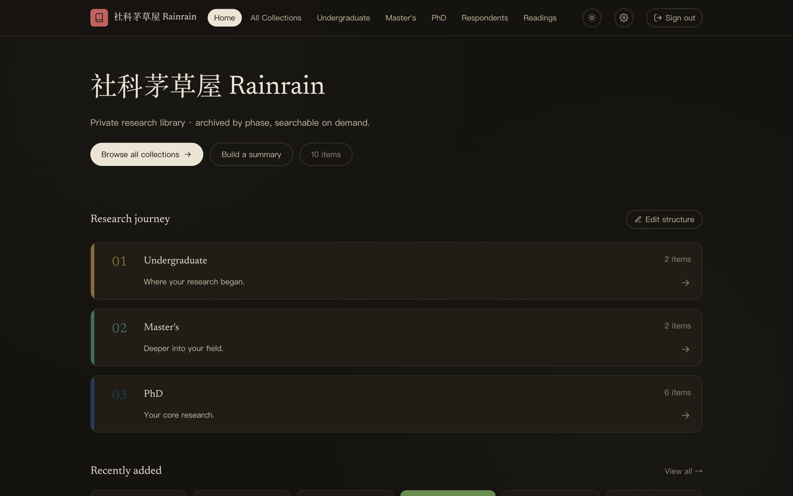
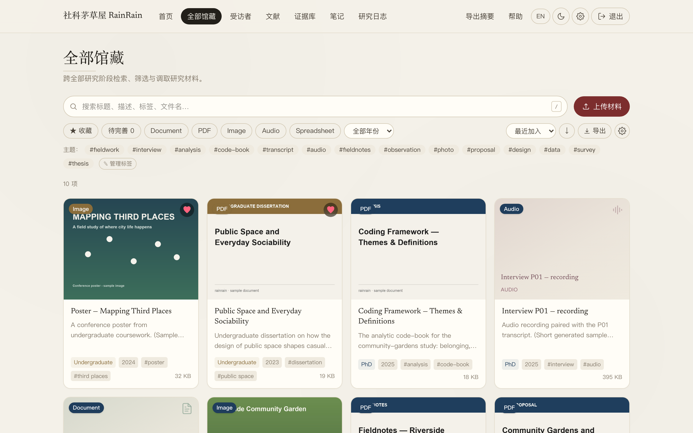
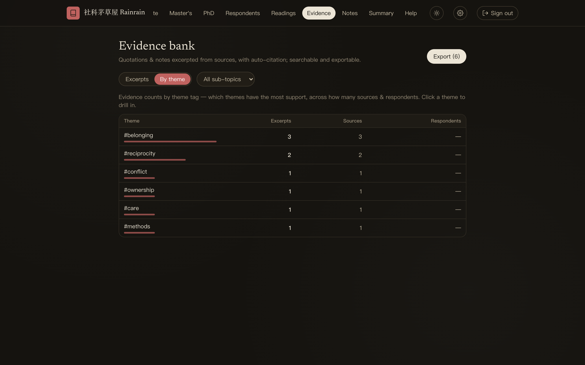
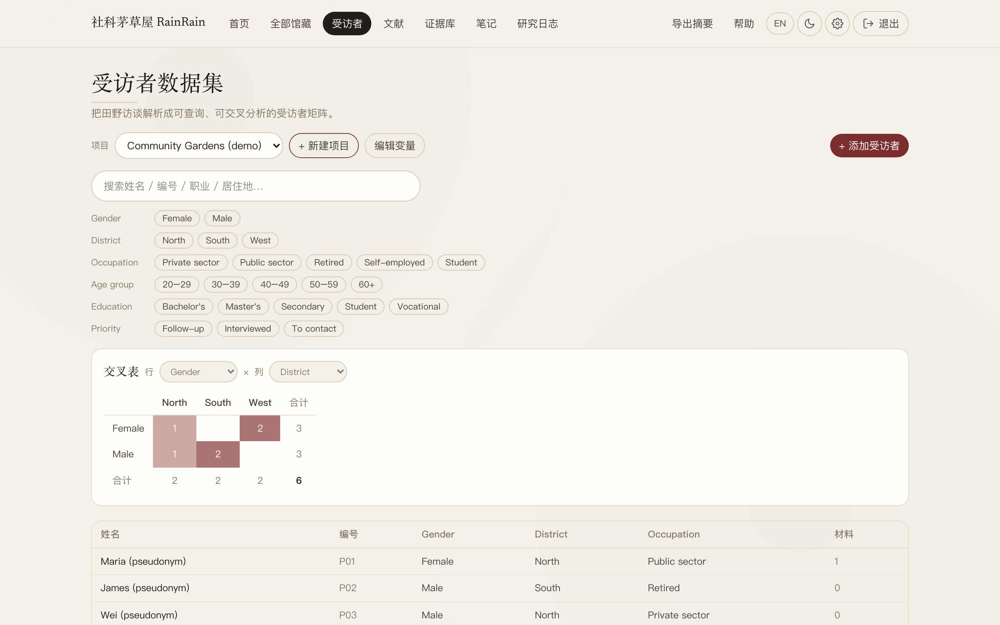
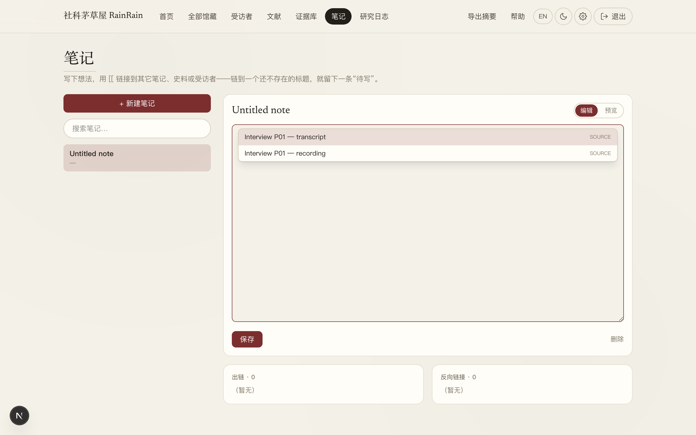

# Rainrain · 社科学生的本地研究图书馆

[](LICENSE) [](CITATION.cff) 

把文献、史料、田野、笔记，收进一个私密、可检索、能编码的本地图书馆。

Rainrain 是「[社科茅草屋](https://rainrain-ten.vercel.app)」系列里的研究资料工具——把你做研究要用的一切（论文、史料扫描、访谈录音、田野笔记、引文证据）集中管理，可全文检索、可摘录编码，**全程在你自己电脑上、资料绝不上云**。免费、无订阅、无条数限制。



## 为什么社科学生该用 Rainrain

做社科研究，你的材料和别人不一样：访谈录音带着受访者实名、同意书是敏感数据、史料扫描要能全文检索、质性编码要能溯源。通用网盘/笔记软件照顾不到这些，专业软件（NVivo / Atlas.ti）又贵又重、还要你把数据导入上传。Rainrain 就是冲着社科研究的这些痛点做的：

- **敏感数据不上云**——访谈录音、受访者实名、同意书全存在你本机。要过伦理审查、处理敏感田野的研究，尤其重要。
- **轻量质性编码，替代贵重的 NVivo**——划选 → 打主题码 → 自动带出处 → 按码聚成编码本 → 一键导出带引用的引文。课程论文、学位论文、单人项目足够覆盖，且免费、无条数限制。
- **一手材料 + 二手文献分开管**——史料/访谈/田野归一处、全文检索（连扫描件 OCR、简繁日互搜）；已读论文另立清单、标注、按子课题归类。
- **受访者当数据库用**——把田野对象整理成可筛选、可交叉分析的数据集，一眼看出哪个群体更常提某个主题。
- **笔记双链扎根一手材料**——写笔记 `[[` 直接链到某份史料、某个受访者，把想法长在材料上；这是纯笔记软件做不到的。

## 你是不是也这样

- 文献 PDF、史料扫描、访谈录音、田野笔记，散在十几个文件夹、微信和网盘里，要用时翻半天找不到。
- 写论文引用，得一份份文件翻回去找出处。
- 访谈录音、受访者实名、同意书——敏感数据，不敢往云端传。
- 想做质性编码，NVivo / Atlas.ti 又贵又重。

## 它怎么帮你（按研究流程）

- **收 & 归档**：把文件拖进去，自动整理成卡片、生成封面、建全文索引。
- **找**：全文检索——连扫描件 OCR 出来的字都能搜，简体词还能搜到繁体和日文。



- **读**：PDF 翻页缩放、Word/转录稿内联、录音图片就地打开，不用到处找软件。
- **摘 & 编码**：在文档里划选文字存成「证据」，自动带出处；按主题聚成编码本，一键导出带引用的引文。



- **田野**：把受访者整理成可搜索、可筛选、可交叉表的数据集，每人名下关联录音、转录与关键引文。



- **想 & 连**：写笔记时用 `[[` 直接链到某份史料、某个受访者、或另一条笔记，把想法扎根在一手材料上；链到还没写的标题就留一条「待写」。



- **输出**：一页式研究摘要，导出 PDF 或文本，方便汇报、申请、给导师看。

## 适合谁

写论文、做田野、读大量文献的社科学生与研究者。说句实话，方便你选对工具：想要 AI 跨文档问答 → NotebookLM；想要纯笔记 + 知识图谱 → Obsidian；而 Rainrain 的专长是**私密的一手材料库 + 轻量质性编码 + 扎根材料的笔记**。三者其实可以搭配用。

## 关于质性编码（coding）

它本身就是一套轻量的质性编码工具：在任意材料里划选一段 → 打上主题码 → 自动带出处。「Evidence 证据库」按码聚成编码本：每个码有多少条引文、跨多少份材料/受访者，一目了然；还能一键导出带引用的引文，直接进论文。

主题分析（thematic analysis）、扎根理论的开放编码（open coding）、框架分析（framework analysis），都吃这套「划选 → 打码 → 按码检索 → 写作」的闭环，比纯靠 Word 高亮 + Excel 列表强得多。码直接挂在一手材料和受访者身上、可随时溯源；受访者页还能把编码和人口学变量做交叉表。

诚实的边界：它是轻量编码，没有 NVivo / Atlas.ti 那种多层级码树、码间关系建模、复杂矩阵/布尔查询，也没有双编码者信度（inter-coder reliability）。课程论文、学位论文、单人项目——这套足够覆盖核心；若要团队编码 + 信度检验 + 很深的码树，再上 NVivo / Atlas.ti / Dedoose（但它们贵、重，且要把数据导入/上传）。

## 下载

首次打开系统会拦一下（应用未做代码签名，属正常）。

| 平台 | 文件 | 说明 |
|------|------|------|
| Windows | `Rainrain-Setup-0.1.0.exe` (189MB) | 双击安装；弹「已保护你的电脑」→ 更多信息 → 仍要运行 |
| Mac（仅 Apple 芯片） | `Rainrain-0.1.0-arm64.dmg` (739MB) | 拖进「应用程序」；若提示「已损坏」→ 右键打开，或终端跑 `xattr -dr com.apple.quarantine /Applications/Rainrain.app` |

到 [Releases](../../releases) 下载。装完默认密码 `rainrain`，进设置改成自己的。

在线预览（免安装、只读演示）：<https://rainrain-ten.vercel.app>，密码 `rainrain2026`。

> **完整图文使用说明（15 节，每一步都配了截图）：[使用说明.md](使用说明.md)** —— 安装、搜索、阅读、上传、摘录编码、受访者数据库、双链笔记、备份恢复、常见问题，都在里面。

## 三分钟上手

1. 安装（Windows 双击 `.exe`；Mac 打开 `.dmg` 拖进「应用程序」）。
2. 打开，输入默认密码 `rainrain` → 进设置改成自己的密码。
3. 把你的文献 / 史料 / 录音拖进去 → 自动归类。
4. 用搜索找、划选存证据、写笔记 `[[` 链接——开始长你自己的研究知识网。

## 隐私

所有研究资料只存在你本机，永不上传任何云；可选的 AI 摘要也在本机运行。对要过伦理审查、处理敏感访谈的社科研究，尤其重要。

## 许可证 / License

Rainrain 采用 **Business Source License 1.1（BSL 1.1）**——源码公开可读，但不是「随便拿去用」的那种开源：

- **个人、学术研究、教学、非营利与教育机构**使用**完全免费**（包括用在你真实的研究和论文里）。
- **商业 / 营利性使用**需要向作者取得商业授权。
- 每个版本在其 **Change Date（2030-07-03）**后自动转为 **Apache License 2.0**（彻底开源）。

完整条款见 [LICENSE](LICENSE)。想要商业授权，请邮件联系作者 Kirsten Chin <Kirstenchin1@outlook.com>，或在本仓库开一条 [issue](https://github.com/chinnkirsten/rainrain/issues)。

> 一句话：穷学生和研究者随便用、拿去写论文没问题；公司要用请付费；四年后彻底开源。

## 引用 Rainrain / Citation

如果 Rainrain 帮到了你的研究，请在论文或报告里引用它——这对一个独立的学术工具能不能活下去，很重要。

GitHub 仓库页右侧的 **“Cite this repository”** 按钮会根据 [CITATION.cff](CITATION.cff) 自动生成 APA、BibTeX 等格式。手动引用可用：

> Kirsten Chin. (2026). *Rainrain (社科茅草屋 Rainrain): a local-first research library and lightweight qualitative-coding tool for social scientists* (Version 0.1.0) [Computer software]. https://github.com/chinnkirsten/rainrain

BibTeX：

```bibtex
@software{chin_rainrain_2026,
  author  = {Chin, Kirsten},
  title   = {{Rainrain (社科茅草屋 Rainrain): a local-first research library and lightweight qualitative-coding tool for social scientists}},
  year    = {2026},
  version = {0.1.0},
  url     = {https://github.com/chinnkirsten/rainrain}
}
```

（后续会为每个发布版本申请 Zenodo DOI，届时这里会给出带 DOI 的稳定引用。）

## 参与贡献 / Contributing

欢迎报 bug、提功能建议、帮忙翻译或改进文档。请先读 [CONTRIBUTING.md](CONTRIBUTING.md)——尤其注意「绝不提交真实研究数据」这条红线。

## 作者 / Author

Kirsten Chin ·「社科茅草屋」系列
