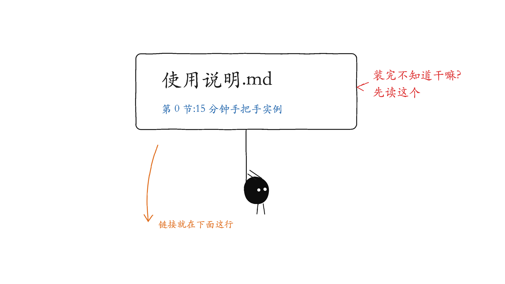
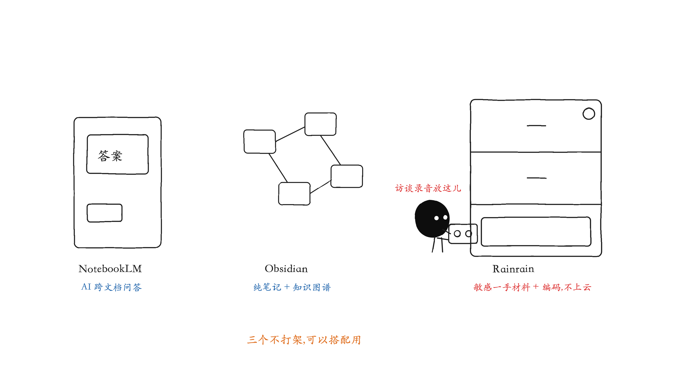

# Rainrain · 社科学生的本地研究图书馆


把文献、史料、田野、笔记，收进一个私密、可检索、能编码的本地图书馆。

Rainrain 是「[社科茅草屋](https://rainrain-ten.vercel.app)」系列里的研究资料工具——把你做研究要用的一切（论文、史料扫描、访谈录音、田野笔记、引文证据）集中管理，可全文检索、可摘录编码，**全程在你自己电脑上、资料绝不上云**。免费、无订阅、无条数限制。


## 下载安装（先看这个）

> 不想装、只想先看看长什么样？在线体验版（免安装、只读演示）：<https://rainrain-ten.vercel.app>，密码 `rainrain2026`。

安装包在 **[Releases 页面](../../releases)** 下载。0.2.0 起中英文界面内置切换（右上角「中 / EN」按钮），下一个包就够。

### Windows（比较省事）

1. 下载 `Rainrain-Setup-0.2.1.exe`，双击。
2. 大概率弹一个蓝色全屏提示「**Windows 已保护你的电脑**」——**这不是病毒警告**，只是这个软件没花钱买微软的签名证书。点左边的小字「**更多信息**」，再点「**仍要运行**」。
3. 后面就是普通安装，一路下一步。装完开始菜单/桌面就有 Rainrain。


### Mac（Apple 芯片，即 M1/M2/M3/M4 的机器；老款 Intel Mac 暂不支持）

1. 下载 `Rainrain-0.2.1-arm64.dmg`，双击打开——弹出的小窗口里有三样东西：**Rainrain 图标、Applications 文件夹、《安装必读.txt》**。
2. 把 **Rainrain 图标拖到旁边的 Applications 上**，等复制完（文件挺大，几秒到一分钟）。
3. **关键一步，别跳过**：打开「访达 → 应用程序」，亲眼确认 Rainrain 真的在里面——拖拽偶尔会静默失败，没报错 ≠ 装好了。不在就再拖一次。


4. 双击打开。第一次多半会被拦：「已损坏，无法打开」或「无法验证开发者」。**应用没坏**，这是 macOS 对所有没交年费给苹果的软件的统一拦法。任选一个解决：
   - **不用终端**：打开「系统设置 → 隐私与安全性」→ 一路拉到最底部 → 有一行「已阻止 Rainrain…」→ 点「**仍要打开**」→ 再确认一次，以后就正常了。
   - **用终端**：打开「终端」，粘贴下面这行回车，再双击打开：

   ```bash
   xattr -dr com.apple.quarantine /Applications/Rainrain.app
   ```


5. 上面都不行？打开 dmg 里那份《**安装必读.txt**》——里面有一段可以整段照抄的终端命令（自动找挂载路径、复制、解除拦截、打开），一定能装上。

### 装好之后的前三分钟

1. 默认密码 `rainrain`（全小写）。
2. 进去后：右上角「中 / EN」切成中文；右上角齿轮 →「设置」→ 把密码改成自己的。
3. 完全不知道这软件是干嘛的？往下看——



> **📖 [使用说明.md](使用说明.md)** —— 第 0 节有一个 **15 分钟手把手实例**（用自带示例数据，照着点一遍就全明白了），后面 15 节覆盖每个功能，每步配截图。

> 以后**升级新版本不会丢数据**：数据和应用分开存放，直接覆盖安装即可（详见使用说明第 1 节）。


## 为什么社科学生该用 Rainrain

做社科研究，你的材料和别人不一样：访谈录音带着受访者实名、同意书是敏感数据、史料扫描要能全文检索、质性编码要能溯源。通用网盘/笔记软件照顾不到这些，专业软件（NVivo / Atlas.ti）又贵又重、还要你把数据导入上传。Rainrain 就是冲着社科研究的这些痛点做的：

- **敏感数据不上云**——访谈录音、受访者实名、同意书全存在你本机。要过伦理审查、处理敏感田野的研究，尤其重要。
- **轻量质性编码，替代贵重的 NVivo**——划选 → 打主题码 → 自动带出处 → 按码聚成编码本 → 一键导出带引用的引文。课程论文、学位论文、单人项目足够覆盖，且免费、无条数限制。
- **一手材料 + 二手文献分开管**——史料/访谈/田野归一处、全文检索（连扫描件 OCR、简繁日互搜）；已读论文另立清单、标注、按子课题归类。
- **受访者当数据库用**——把田野对象整理成可筛选、可交叉分析的数据集，一眼看出哪个群体更常提某个主题。
- **笔记双链扎根一手材料**——写笔记 `[[` 直接链到某份史料、某个受访者，把想法长在材料上；这是纯笔记软件做不到的。
- **随手记，闪念不丢**（0.2.1 起）——任意页面按 `⌘J`（Win：`Ctrl+J`）弹出速记框，读文献时冒出的想法两秒记进研究日志或笔记，同样能 `[[` 链到材料；桌面版还能 `⌘⇧J` 从后台一键唤出（在 Word 里写论文时也能记）。

## 你是不是也这样

- 文献 PDF、史料扫描、访谈录音、田野笔记，散在十几个文件夹、微信和网盘里，要用时翻半天找不到。
- 写论文引用，得一份份文件翻回去找出处。
- 访谈录音、受访者实名、同意书——敏感数据，不敢往云端传。
- 想做质性编码，NVivo / Atlas.ti 又贵又重。

## 它怎么帮你（按研究流程）

- **收 & 归档**：把文件拖进去，自动整理成卡片、生成封面、建全文索引。


- **找**：全文检索——连扫描件 OCR 出来的字都能搜，简体词还能搜到繁体和日文。


- **读**：PDF 翻页缩放、Word/转录稿内联、录音图片就地打开，不用到处找软件。


- **摘 & 编码**：在文档里划选文字存成「证据」，自动带出处；按主题聚成编码本，一键导出带引用的引文。


- **田野**：把受访者整理成可搜索、可筛选、可交叉表的数据集，每人名下关联录音、转录与关键引文。


- **想 & 连**：写笔记时用 `[[` 直接链到某份史料、某个受访者、或另一条笔记，把想法扎根在一手材料上；链到还没写的标题就留一条「待写」。


- **输出**：一页式研究摘要，导出 PDF 或文本，方便汇报、申请、给导师看。


## 适合谁

写论文、做田野、读大量文献的社科学生与研究者。说句实话，方便你选对工具：想要 AI 跨文档问答 → NotebookLM；想要纯笔记 + 知识图谱 → Obsidian；而 Rainrain 的专长是**私密的一手材料库 + 轻量质性编码 + 扎根材料的笔记**。三者其实可以搭配用。



## 关于质性编码（coding）

它本身就是一套轻量的质性编码工具：在任意材料里划选一段 → 打上主题码 → 自动带出处。「Evidence 证据库」按码聚成编码本：每个码有多少条引文、跨多少份材料/受访者，一目了然；还能一键导出带引用的引文，直接进论文。

主题分析（thematic analysis）、扎根理论的开放编码（open coding）、框架分析（framework analysis），都吃这套「划选 → 打码 → 按码检索 → 写作」的闭环，比纯靠 Word 高亮 + Excel 列表强得多。码直接挂在一手材料和受访者身上、可随时溯源；受访者页还能把编码和人口学变量做交叉表。


诚实的边界：它是轻量编码，没有 NVivo / Atlas.ti 那种多层级码树、码间关系建模、复杂矩阵/布尔查询，也没有双编码者信度（inter-coder reliability）。课程论文、学位论文、单人项目——这套足够覆盖核心；若要团队编码 + 信度检验 + 很深的码树，再上 NVivo / Atlas.ti / Dedoose（但它们贵、重，且要把数据导入/上传）。

## 隐私

所有研究资料只存在你本机，永不上传任何云；可选的 AI 摘要也在本机运行。对要过伦理审查、处理敏感访谈的社科研究，尤其重要。

## 免费使用 · 许可

Rainrain 免费给所有人用——学生、研究者、老师，装了就用，写进真实的研究和论文里都没问题，没有条数限制，也不需要任何授权。

法律细节（一般用不着看）：源码采用 [Business Source License 1.1](LICENSE)，2030 年后自动转为 Apache 2.0；仅当公司想拿它做商业产品时需要联系作者（Kirstenchin1@outlook.com）。

如果它帮到了你，点个 ⭐ 就是最好的支持；想在论文里提到它的话，仓库页右侧的 "Cite this repository" 按钮能一键生成引用格式——完全可选。

## 参与贡献 / Contributing

欢迎报 bug、提功能建议、帮忙翻译或改进文档。请先读 [CONTRIBUTING.md](CONTRIBUTING.md)——尤其注意「绝不提交真实研究数据」这条红线。

## 作者 / Author

Kirsten Chin ·「社科茅草屋」系列
