# Rainrain · 使用说明

私人本地研究图书馆，给社科学生管文献、访谈、编码和写作素材。所有资料只在你本机，永不上云。

**界面语言**：右上角有个「中 / EN」小按钮，点一下整个界面在中文和英文之间切换（本机记住选择）。下文按中文界面写，括号里附英文按钮名，方便你对照英文界面。

目录：0 从这里开始（不知道干嘛的看这节） · 1 安装与首次启动 · 2 界面与导航 · 3 搜索与筛选 · 4 阅读 · 5 上传 · 6 编辑与删除 · 7 摘录证据/质性编码 · 8 受访者数据库 · 9 文献管理 · 10 笔记 · 11 导出摘要 · 12 备份与恢复 · 13 设置/密码/匿名化 · 14 本地 AI（可选） · 15 常见问题/排错

---

## 0. 从这里开始：装好了，然后呢？

> 很多同学装完的第一反应是「这是个啥，我该点哪」。这一节就是答案。**先花 20 分钟照着做，你就明白它是干什么的了。**

### 它到底解决什么问题

你现在的研究材料大概率长这样：文献 PDF 散在微信收藏和下载文件夹里、访谈录音在手机里、转录稿在某个 Word 里、读书笔记在备忘录里、写论文时到处翻「那句话在哪来着」。

Rainrain 把这些**收进一个能全文搜索的私人图书馆**，并且多做三件散装文件夹做不到的事：

1. **划线即编码**——读材料时把关键句划出来、打上主题标签，全部摘录自动汇总成「编码本」，写论文时按主题一键调出所有证据；
2. **受访者数据库**——访谈对象的属性、录音、转录、引文关联在一起，可筛选、可交叉分析；
3. **规范引用**——文献用 DOI 一键录入，引用按 GB/T 7714 / APA 一键复制。

### 第一个 20 分钟（照着点）

1. 登录后先做两件小事：右上角「中 / EN」切成中文；右上角齿轮 →「设置」→ 改掉默认密码。
2. **别急着删示例数据。** 软件自带一个虚构的「社区花园研究」示例（几份访谈转录、编码、受访者），它就是活的教程。
3. 点顶栏「证据库（Evidence）」→ 切到「按主题（By theme）」——看到没，每个主题码下面挂着几条摘录、来自几个受访者。这就是这个软件的核心产出：**编码本**。
4. 回到「全部馆藏（All Collections）」，点开《Interview P01 — transcript》，用鼠标划选任意一句话 → 浮出「摘录（Excerpt）」按钮 → 点它，随便打个标签保存。再回证据库看：你的第一条编码进库了。
5. 按 `⌘K`（Windows 是 `Ctrl+K`），输入任意词——全库搜索：馆藏、文献、笔记、证据、受访者一网打尽。
6. 明白怎么回事了？好——「设置」里没有一键清空，但示例数据在你录入自己的资料后会自动让位；也可以逐条删掉示例。

### 手把手完整实例：15 分钟，从打开软件到攒出一段能写进论文的素材

> 全程用软件自带的示例数据（一个虚构的「社区花园」研究），你不需要准备任何文件，每一步照抄即可。假想任务：城市社会学课程论文《社区花园与邻里互惠》。

**第 1 步 · 摘一条证据**
顶栏点「全部馆藏」→ 打开《Interview P01 — transcript》→ 找到这句话并用鼠标划选：

> We take turns watering — nobody asked us to, it just happens.

划完会浮出一个小按钮「摘录」→ 点它 → 弹出表单：标签填 `reciprocity`，批注填「无组织的互助如何自发形成」→ 保存。
✅ 你应该看到：保存成功，这段话在原文里被金色高亮。

**第 2 步 · 去证据库看它**
顶栏点「证据库」——你刚摘的那条排在最上面，带着出处《Interview P01 — transcript》和 #reciprocity 标签。点标签可以只看这一类。

**第 3 步 · 给码写定义**
证据库切到「按主题」视图 → 找到 reciprocity 那一行 → 点行内的 ✎ → 在「定义」框输入：

> 居民之间非正式的互惠行为：换工、代管、馈赠；不含金钱交易。

点框外任意处，自动保存。
✅ 两周后你再打开，不会忘记这个码是什么意思；答辩被问"你的编码标准"时，这就是答案。

**第 4 步 · 看共现矩阵**
同一页往下滚到「共现矩阵」：找 belonging 行 × reciprocity 列的交叉格。如果数字 ≥1，说明有摘录同时打了这两个码——论文里就可以写一句：「互惠实践的叙述常与归属感表达共现」。

**第 5 步 · 用 DOI 导入一篇真文献**
顶栏「文献」→「+ 添加文献」→ 切到 DOI 页签 → 粘贴：

```
10.1080/01490400490432064
```

→ 点「抓取」。
✅ 你应该看到：Glover (2004) 关于社区花园与社会资本的论文，作者/标题/期刊/年份/卷期全部自动填好。

**第 6 步 · 复制一条规范引用**
在刚导入的这条文献上点「引用」→ 出现一排格式按钮 → 点 `GB/T 7714`。
✅ 引用文字已进剪贴板，直接粘到论文的参考文献里。

**第 7 步 · 导出 Word 底稿**
回「证据库」→ 右上「导出 Word」→ 打开下载的 `evidence-by-theme.doc`。
✅ 你应该看到：每个主题一节、每条引文带出处、码定义附在节首——这就是论文分析章的骨架。你写论文时对着它填肉即可。

**第 8 步 · 记一条跨材料的想法**
顶栏「笔记」→「新建笔记」→ 标题《互惠为什么不需要组织者》→ 正文输入 `[[` 会弹出联想 → 选 Interview P01 插入链接。以后点这个链接直接跳回原始材料。

**第 9 步 · 备份**
右上角齿轮 →「设置」→「下载备份 (.zip)」→ 把 zip 丢进网盘。
✅ 至此你完成了一次完整闭环：**读材料 → 摘证据 → 打码 → 定义 → 文献 → 引用 → 导出写作 → 备份**。你自己的研究就是把示例数据换成你的访谈和 PDF，流程一模一样。

### 三个场景剧本（按你的情况挑一个照做）

**场景 A：两三周后要交课程论文（文本/文献为主）**

1. 首页「编辑结构（Edit structure）」→ 把默认的本硕博阶段改成你的课程名或论文题目（阶段就是文件夹，随便改）。
2. 把要用的文献 PDF 全部拖进「上传（Upload）」，归到这个阶段。有 DOI 的论文顺手在「文献（Readings）」页用 DOI 导入建题录（见第 9 节）。
3. 每读一篇，划线摘关键句 → 打主题标签（比如 `概念界定` `批评` `证据-案例`）。批注写你自己的话。
4. 读完全部材料后，打开「证据库 → 按主题」：你的论文提纲基本已经躺在那了——每个主题就是一节，每节下面全是带出处的引文。
5. 点「导出 Word（Export Word）」→ 得到按主题分组、带出处的 .doc，对着它写论文，引用去「文献」页按格式复制。

**场景 B：毕业论文要做访谈研究**

1. 「受访者（Respondents）」→ 新建项目（你的田野名）→「编辑变量」定义你要记录的属性（年龄/职业/来源地……随你的研究设计）。
2. 每做完一个访谈：录音和转录稿上传进馆藏（文件名带上编号如 `Interview P03`，系统靠 P 编号自动把摘录关联到人）；受访者库里加这个人。
3. 转录稿里划线打码。**码起名的规矩**：宁可多起几个具体的码，也别一个「重要」打天下。
4. 每周去一次「证据库 → 按主题」：给用得多的码点 ✎ 写**定义**（这个码指什么、何时用何时不用）——这是编码本的灵魂，答辩时导师会问；相关的码用「父级」挂成两层。
5. 「矩阵（Matrix）」视图看 受访者 × 主题 的覆盖：哪些人没聊到哪些主题，下次访谈补。共现矩阵看哪两个码总一起出现——那往往是一个发现。
6. 写作时：Word 导出 + 「研究日志（Research log）」里的分析备忘直接支撑「方法」一章。**匿名化**：设置里建好「真名 → 代号」对照表，导出时自动替换（见第 13 节）。

**场景 C：纯文献综述 / 读书笔记**

1. 「文献（Readings）」页当主战场：DOI / BibTeX 批量导入题录，标已读/未读，按子课题归类。
2. 每篇的批注写在条目的「笔记」里；跨文献的想法写进「笔记（Notes）」，用 `[[` 把相关文献、概念链起来——积累一段时间后，反向链接会告诉你哪些概念是你真正的问题意识。
3. 综述初稿：证据库按主题导出 + 文献页按引用格式导出，两边一拼。

### 一个可持续的节奏

- **当天的材料当天进馆**（10 分钟）：访谈完传录音、下了 PDF 就上传打标签。堆积是所有资料管理死掉的原因。
- **读的时候就编码**，不要「先读完再回头摘」——回头你不会摘的。
- **每周五看一眼编码本**，合并重复的码、写定义、给爆炸的码拆子码。
- **每周下载一次备份 zip** 放到网盘/U 盘（首页会提醒你）。

### 它不适合什么（诚实边界）

多人协作编码、双编码者信度检验、五层以上码树、复杂布尔查询——这些请上 NVivo / Atlas.ti / Dedoose。单人课程论文到博士论文的定性分析，这里够用，而且你的数据不用上传给任何人。

---

## 1. 安装与首次启动

### Windows

- 双击 `Rainrain-Setup-0.2.0.exe` 安装。
- 首次打开弹「已保护你的电脑 / Windows protected your PC」→ 点 更多信息（More info）→ 仍要运行（Run anyway）。程序未做数字签名，属正常提示。

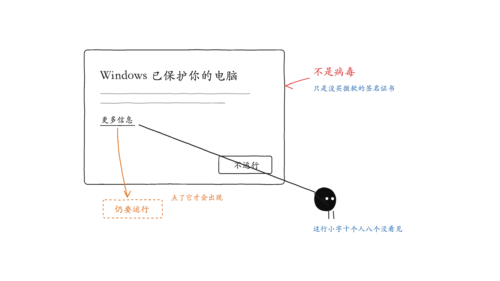


### Mac（仅 Apple 芯片 M 系列）

- 打开 `Rainrain-0.2.0-arm64.dmg`，弹出的窗口里有三样东西：Rainrain 图标、Applications 文件夹、《安装必读.txt》。**把 Rainrain 拖到窗口内的 Applications 上**，等复制完成（约 700MB，几秒到几十秒）。
- **拖完务必验证**：打开「访达 → 应用程序」，能看到 Rainrain 才算装上——拖拽偶有静默失败，没报错不等于成功。

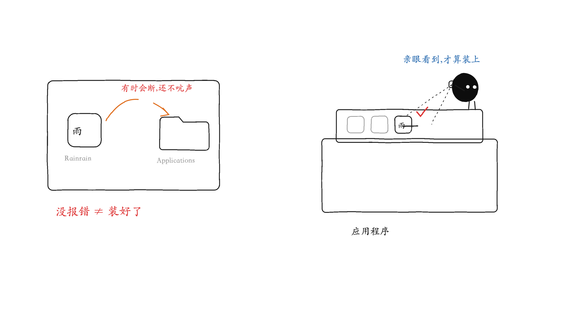

- 首次打开被拦（「已损坏」或「无法验证开发者」）——未签名应用的正常拦截，任选其一解决：
  - **不用终端**：双击被拒后 → 系统设置 → 隐私与安全性 → 拉到最底部 → 「仍要打开（Open Anyway）」→ 再确认一次。（新版 macOS 已不支持右键打开绕过，走这条。）
  - **终端一行**：`xattr -dr com.apple.quarantine /Applications/Rainrain.app`
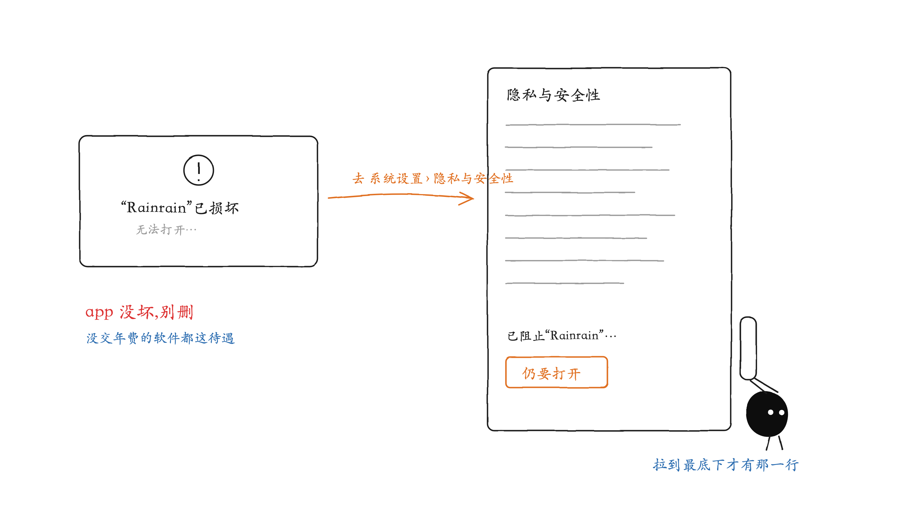

- 拖拽装不上时的全终端安装（自动识别挂载路径，不要凭猜 /Volumes/ 卷名）：

```bash
V=$(hdiutil attach ~/Downloads/Rainrain-0.2.0-arm64.dmg -nobrowse | grep -o "/Volumes/.*" | head -1)
cp -R "$V/Rainrain.app" /Applications/
hdiutil detach "$V"
xattr -dr com.apple.quarantine /Applications/Rainrain.app
open /Applications/Rainrain.app
```

- 以上内容 dmg 里的《安装必读.txt》都有，装不上时打开它照做即可。

### 通用

- 输入默认密码 `rainrain` 进入。
- 登录框有「记住我（Remember me）」勾选：**不勾**，关掉应用/浏览器就要重输密码（公用电脑用这个）；**勾上**，本机 30 天免登录。
- 进去第一件事：右上角齿轮 →「设置」→ 改成自己的密码（只存本机）。

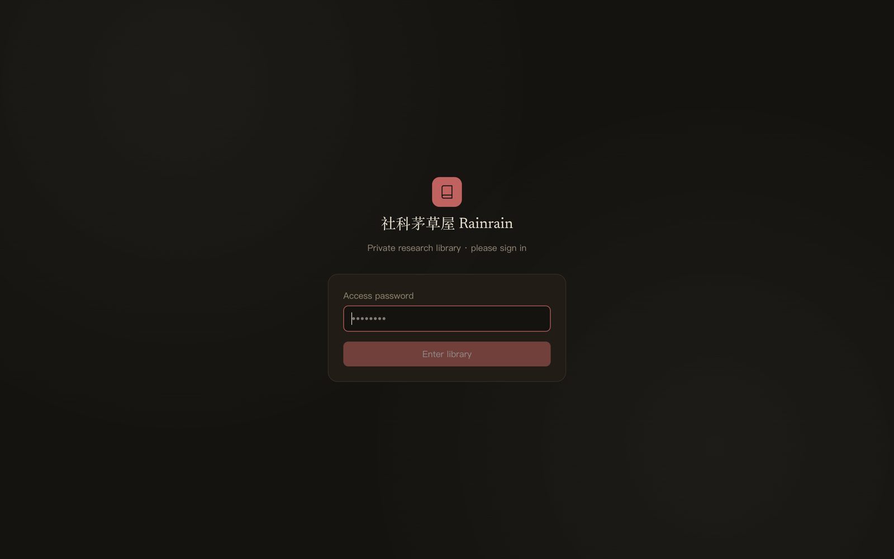

*配图 S1：登录页——密码框、「记住我」勾选、右上角中英切换*

> 提示：自带一套示例内容（一个虚构的社区花园研究），方便你看每个功能怎么用；你一旦录入自己的资料，示例会自动让位。

### 升级到新版本（数据不会丢）

**你的全部资料和应用是分开存放的**：数据在系统的用户目录（Windows `%APPDATA%\Rainrain`、Mac `~/Library/Application Support/Rainrain`），应用升级只替换程序本身，**不碰数据**。

- **Windows**：直接双击新版 `Rainrain-Setup-x.x.x.exe` 安装，覆盖旧版即可。打开后所有资料原样都在。
- **Mac**：把新版 Rainrain 拖进「应用程序」，提示"已存在"时选**替换**。打开后所有资料原样都在。
- **不需要重新上传任何文件、不需要重新编码**。密码、文献、证据、笔记、受访者、备份，全部保留。
- 稳妥起见：升级前顺手在「设置」里下载一份备份 zip（30 秒的事，图个安心）。

## 2. 界面与导航

- 首页「研究历程（Research journey）」：按研究阶段分卡片，点进去就是该阶段的馆藏；右侧「编辑结构（Edit structure）」可增删改阶段/子课题——不是必须按本硕博分，改成课程、年份、项目都行。
- 顶部导航：首页 · 全部馆藏（All Collections）· 受访者（Respondents）· 文献（Readings）· 证据库（Evidence）· 笔记（Notes）· 研究日志（Research log）；右侧还有 导出摘要（Summary）和 帮助（Help）。
- 右上角一排小按钮：**中 / EN**（切界面语言）· 月亮/太阳（明暗主题）· 齿轮（设置）· 退出。
- **⌘K（Windows：Ctrl+K）随时呼出全局搜索**——不管你在哪个页面。
- **⌘J（Windows：Ctrl+J）随手记**——任何页面弹出一个小输入框，闪念直接记下来，回车（⌘↩）即存进「研究日志」（时间流水，最适合闪念）；切一下开关也能存成笔记（首行自动成标题）。框里输入 `[[` 同样有联想，可以直接链到史料、受访者或笔记——读文献读到一半冒出的想法，两秒记完回去接着读。
- 两个齿轮要分清：右上角导航栏的齿轮 = 设置（密码/备份/匿名化/界面偏好）；馆藏页工具栏里的齿轮 = 快速备份 + 回收站。
- 首页顶部偶尔出现一条淡金色提示：那是**备份提醒**（从未备份、或距上次备份超过 7 天时出现），点「去备份」或「本周不再提醒」。


*配图 S2：首页「研究历程」+ 顶部导航栏（右上角依次为：语言切换 / 明暗主题 / 设置 / 退出）*

## 3. 搜索 · 筛选 · 排序

**两层搜索，用途不同：**

- **⌘K 全局搜索**：跨全库——馆藏、文献、笔记、证据、受访者、研究日志一起搜，结果分组显示，↑↓ 选中回车直达。找「我记得有这么个东西但忘了在哪」用它。
- **馆藏页搜索框**：只搜当前馆藏，但搜得更深——标题、标签、**文档正文全文**（含扫描件 OCR 出来的字）都算。按 `/` 直接聚焦。

- 简繁日通搜：输入简体也能命中繁体/日文写法，按相关度排序。

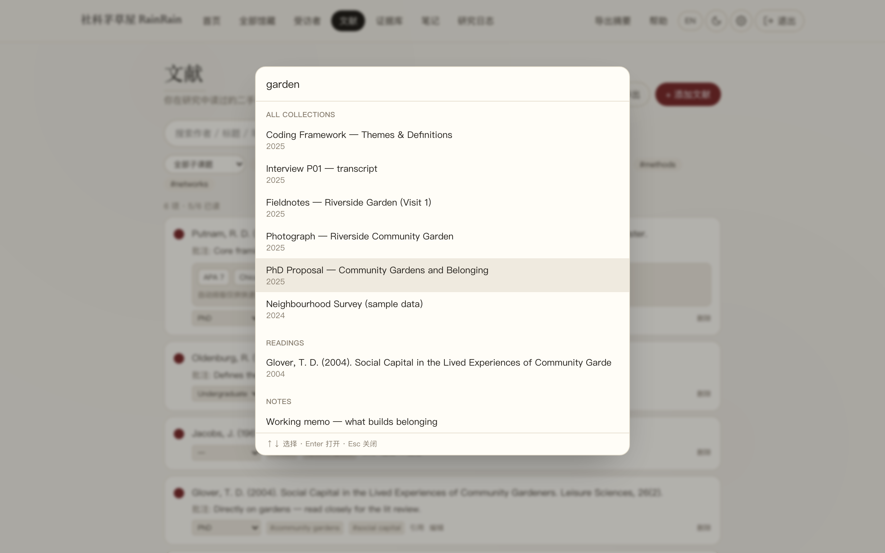

*配图 N1：⌘K 全局搜索——分组显示馆藏 / 文献 / 笔记 / 证据等命中，↑↓ 选择回车直达*
- 筛选：按类型（PDF/图片/录音/表格…）、年份、主题标签、收藏 ★；右侧切网格/列表、改排序（最近/年份/标题/大小）。


*配图 S3：全部馆藏页：搜索框 + 一排筛选 + 卡片网格*

## 4. 阅读材料

- 点任意卡片打开查看器。PDF：底部有缩放（50–400%）和翻页（‹ 页 X / N ›）。
- **PDF 正文可以直接划选了**（0.2.0 起）——划选即出「摘录」按钮，页码自动带上（见第 7 节）。扫描件例外：图片型 PDF 没有文字层，划不了，用手动摘录。
- Word / 文本 / 访谈转录：内联显示，划选摘录同理。
- 图片可放大、录音/视频就地播放；两侧 ‹ › 切换上一项 / 下一项。

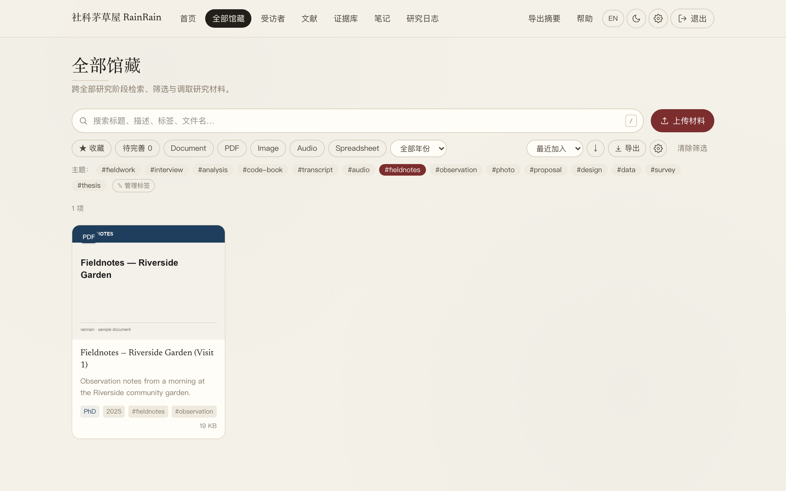

*配图 S4：PDF 查看器（底部缩放 + 翻页控件）*

## 5. 上传材料

- 在任意馆藏页点 上传（Upload）。
- 选「归入哪个阶段/子课题」，把文件拖进去（可一次多选，可加标签）。
- 上传后自动：生成封面、建全文索引（立刻可搜）；扫描件自动 OCR（仅 macOS；Windows 上文字版 PDF/Word/图片/录音都正常，只是新扫描件不自动 OCR）。

> 支持的文件类型：PDF、Word/RTF/txt/md、PPT、图片（jpg/png/tiff/heic…）、表格（xlsx/csv）、数据（geojson/json/kml…）、录音（mp3/m4a/wav…）、视频（mp4/mov…）。

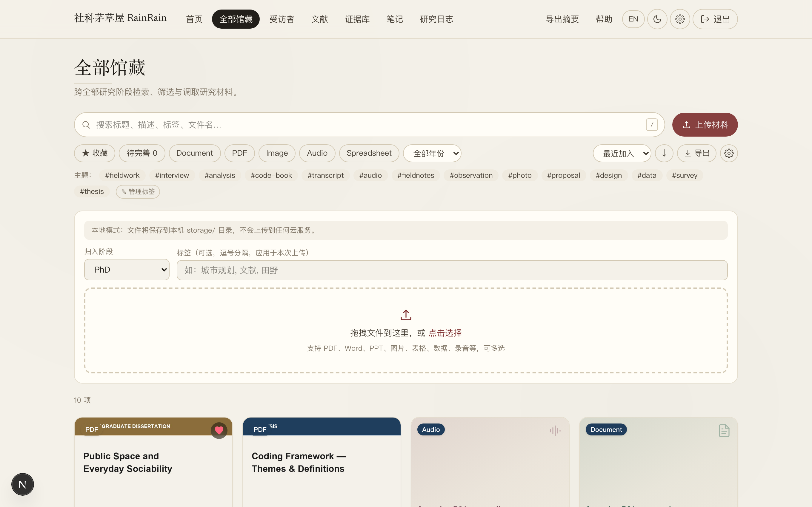

*配图 S5：上传面板（选阶段 + 拖拽区 + 标签）*

## 6. 编辑与删除条目

- 打开某条目 → 点 编辑（Edit），可改标题、描述/笔记、年份、阶段、标签，以及著录信息（作者/出版/馆藏/索书号/版本，用于规范引用）。
- 删除 → 进回收站（不会立刻消失，可还原；见第 12 节）。示例条目也能删。

## 7. 摘录证据 / 质性编码（coding）

这是做访谈/文本分析的核心：把材料里的关键句摘出来、打上主题码，自动汇成编码本。

### 7.1 摘录

- 打开一份文档或 PDF → 鼠标划选一段文字 → 浮出「摘录（Excerpt）」→ 填主题码（标签，逗号分隔）、批注、页码（PDF 划选时页码自动填好）→ 保存。证据自动带来源出处。
- 图片/扫描件不能划选 → 证据库里「+ 添加证据」手动录入。

### 7.2 编码本（证据库 → 按主题）

- 顶部「证据库（Evidence）」汇总所有摘录；切「按主题（By theme）」看编码本：每个码多少条摘录、跨多少来源、覆盖多少受访者。
- **写定义**：每行码后面有个 ✎，点开可以写这个码的定义（指什么、何时用、何时不用）。两周后的你和答辩时的导师都会感谢这个动作。
- **建层级**：✎ 展开里还能选「父级」，把子码挂到父码下（表格里会缩进显示）。一层够用；要五层码树请上 NVivo。
- **共现矩阵**：编码本表格下方，前 8 个码两两同时出现在同一条摘录里的次数，颜色越深共现越多——高共现往往提示两个主题相关或重叠，值得写进分析。

### 7.3 矩阵与导出

- 「矩阵（Matrix）」视图：受访者 × 主题 的框架矩阵（framework matrix），点单元格看对应引文；哪一格空着 = 哪个人没聊到哪个主题。
- **导出 Word**：按主题分组、每条带出处、码定义随附、自动应用匿名化对照表（见第 13 节）——直接当论文的证据附录或写作底稿。
- 「导出（Export）」（复制为 Markdown）也在，喜欢纯文本工作流的用。

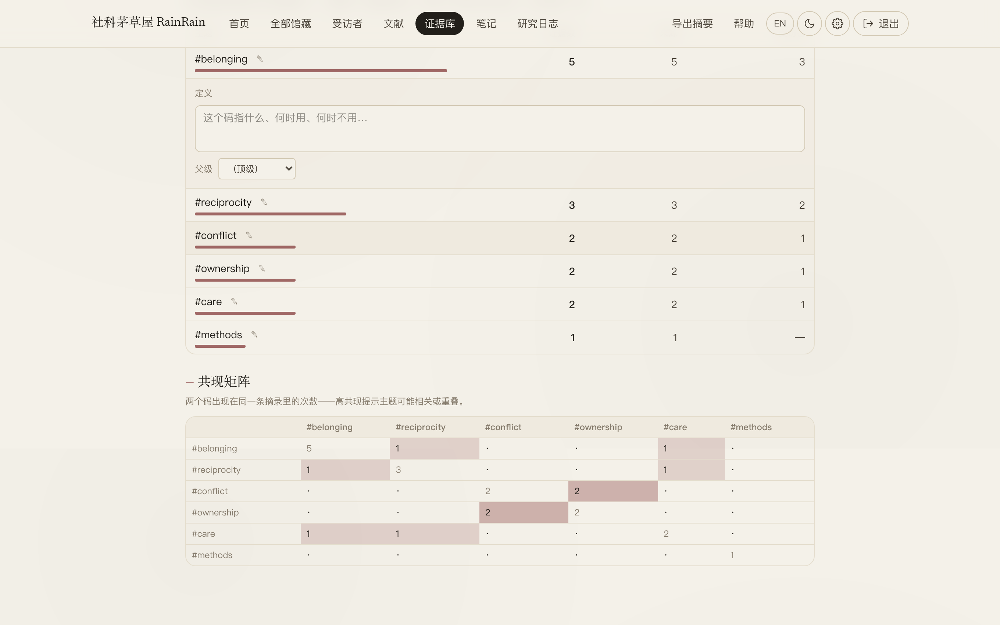

*配图 N3：共现矩阵——两个码同摘录出现的次数，颜色越深共现越多*

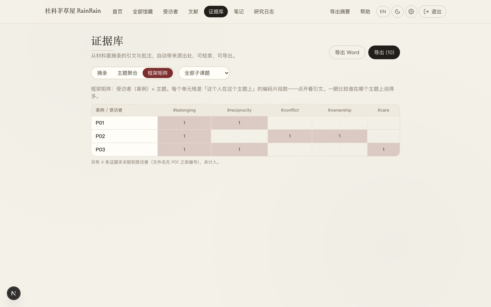

*配图 N4：「框架矩阵」视图——受访者 × 主题，点单元格看对应引文*

> 方法对应：这套「划选→打码→定义→按码检索→写作」直接对应 主题分析（thematic analysis）、扎根理论开放编码、框架分析。


*配图 S6：证据库「主题聚合」编码本——每行可点 ✎ 展开「定义 / 父级」编辑（图中 #belonging 已展开）*

## 8. 受访者数据库（多项目 + 可自定义变量）

把访谈对象整理成可查询、可交叉分析的数据库；每个研究/田野是一个独立项目，自己定义要记录的变量。

### 8.1 选/建项目

- 顶部项目下拉切换不同田野；点 + 新建项目（New project）开一个新研究。

### 8.2 编辑变量

- 点 编辑变量（Edit variables）。
- 每个变量可设：显示名、类型（类别 / 数值 / 文本）、是否可筛选。类别型 → 变成分面筛选 + 交叉表维度；数值型如年龄；文本型如备注。
- 可增 / 删 / 改名 / 调顺序 → 保存。改完立刻反映到筛选和交叉表。

### 8.3 加/改受访者

- 点 + 添加受访者（Add respondent），按当前项目的变量自动生成表单；点表格某行可编辑或删除。
- **编号（Code）很重要**：给每人一个 P01 / P02 式编号，访谈转录的文件名里也带上（如 `Interview P01 — 转录`），系统靠它把证据摘录自动关联到人。

### 8.4 查询与分析

- 上方分面筛选（点标签即筛）；搜索框搜姓名/编号/任意字段。
- 交叉表：选 行 × 列 两个类别变量，实时出计数热力表（如 职业 × 地区）。
- 点某位受访者：完整档案 + 录音播放 + 转录稿 + 关键引文（Key quotes，按编号自动关联其名下的证据摘录）。


*配图 S7：受访者页：分面筛选 + 交叉表*

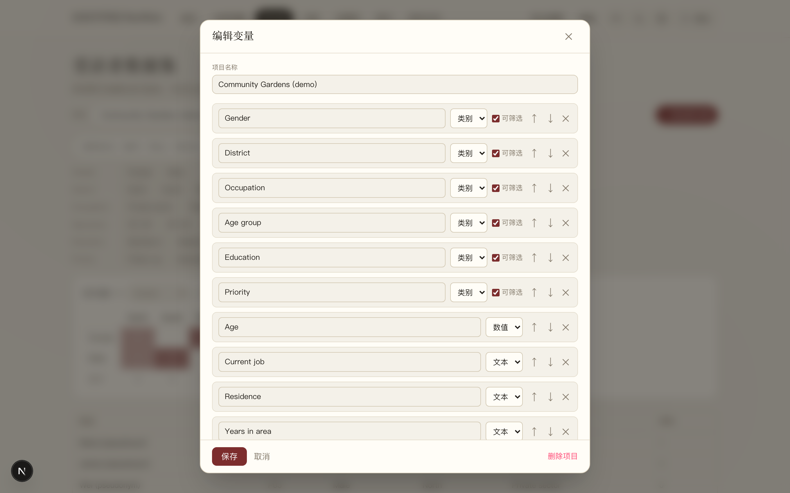

*配图 S8：「编辑变量」弹窗（变量列表 + 类型/可筛选）*

## 9. 文献管理（Readings）——0.2.0 大升级

二手文献的书目库，和一手材料（馆藏）分开管。现在是真正的文献管理，不只是清单：

### 9.1 三种录入方式（点「+ 添加文献」后选页签）

- **DOI**：粘贴 DOI（`10.xxxx/xxxx` 或 doi.org 链接）→ 抓取 → 作者/标题/期刊/年份/卷期页全部自动填好。有 DOI 的论文一律用这个，10 秒一条。
- **BibTeX / RIS 粘贴导入**：从 Google Scholar（引用 → BibTeX）、Zotero、知网导出的题录，整段粘进来，一次可导多条。
- **手动**：老书、中文文献、灰色文献没有 DOI 的，按字段填（类型选 期刊论文/专著/文集章节/学位论文/报告/网络资源）。也可以只在底下的快速框里粘一条现成的题录文字。

### 9.2 引用与导出

- 每条文献点「引用（Cite）」→ 一排格式按钮：**APA 7 / Chicago / GB/T 7714 / BibTeX / RIS**，点哪个复制哪个，直接粘进论文或 Zotero。
- 右上「导出（Export）」把当前筛选出的所有文献整体导出为 .bib / .ris / 纯文本题录表——投稿、给导师、换工具都不锁死你。
- 自动排版仅供快速取用，正式投稿前请自己核对一遍。

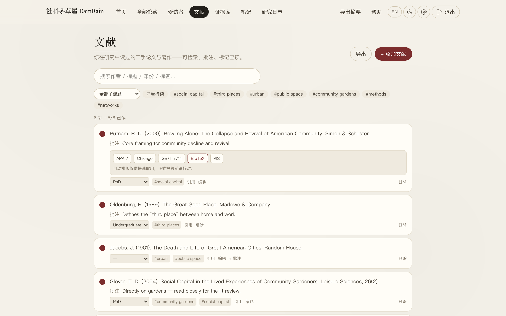

*配图 N2：文献条目的「引用」面板——APA 7 / Chicago / GB/T 7714 / BibTeX / RIS 点哪个复制哪个*

### 9.3 日常管理

- 圆点标「已读/未读」，「只看未读」一键筛选；+ 批注 记读后感；按子课题归类；标签聚合。
- 点「编辑（Edit）」可随时补全或修正著录字段。

## 10. 笔记（Notes · 扎根材料的双链）

- 顶部 笔记（Notes）→ 新建笔记（New note）。
- 正文输入 `[[` 触发联想补全——可链到其它笔记 / 馆藏条目 / 受访者；↑↓ 选、回车插入。
- 链到一个还不存在的标题 = 留一条「待写」（左下「待写清单」可见，点一下即新建那条笔记）。
- 点 预览（Preview）看渲染后的链接（可点击跳转）；每条笔记底部有出链 + 反向链接（谁链到了我）。


*配图 S9：笔记编辑：输入 [[ 弹出联想补全*

## 11. 导出摘要（Summary）

- 顶部 导出摘要（Summary）：勾选要包含的章节 → 打印为 PDF 或复制为文本。一页式研究简介，方便汇报/申请/给导师。

## 12. 备份与恢复

**你的全部研究资料就在本机一个文件夹里，备份 = 把它打包。两条路：**

### 快捷路（推荐）

- 右上角齿轮 →「设置」→「备份与恢复」→ **下载备份 (.zip)**——整个资料库打成一个 zip 存到哪都行（建议丢网盘/U 盘一份）。
- 同一处的「从备份恢复…」选之前的 zip，一键恢复（会覆盖同名文件，恢复前会跟你确认）。
- 设置页还显示当前**资料库占用**大小；首页会在超过 7 天没备份时温和提醒你。

### 手动路（换电脑/大修）

- 完全退出应用。
- 数据目录：Windows `%APPDATA%\Rainrain`、Mac `~/Library/Application Support/Rainrain`。
- 把整个 `storage` 文件夹拷走就是全量备份；放回去就是恢复。

> 回收站：「全部馆藏」工具栏的齿轮 ⚙ 里 → 回收站。删除的条目先进这里，可还原或彻底删除。

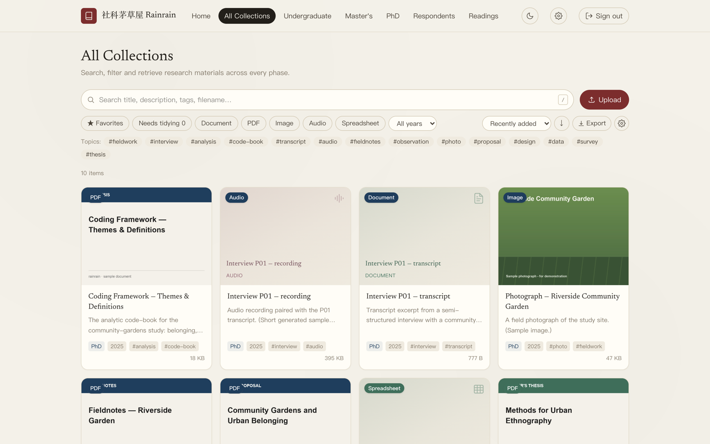

*配图 S10：全部馆藏页工具栏的齿轮 ⚙ 菜单——立即备份 / 回收站*

## 13. 设置 · 密码 · 匿名化 · 界面偏好

右上角齿轮 →「设置」，里面从上到下：

- **界面偏好**：界面字号三档（15/16/17px，全站等比缩放）；禅音开关（极轻的风铃声，默认关）。
- **安全 · 访问密码**：输当前密码 + 新密码即改，只存本机。登录时的「记住我」不勾选 = 每次关掉都要重输（公用电脑务必不勾）。
- **备份与恢复**：见第 12 节。
- **匿名化（Anonymisation）**：建一张「真名 → 代号」对照表（如 张伟 → P01）。之后**导出证据、导出 Word、导出研究日志时自动把真名替换成代号**——受访者身份不会跟着你的论文材料外泄。这是访谈研究的伦理底线，建议第一次录入受访者时就把对照表建好。注意：长名要排在短名前面（先「张伟民」后「张伟」），不然会替换串位。
- **隐私**：所有研究资料只在本机的数据目录，永不上传任何云；可选的 AI 摘要也在本机运行。

## 14. 本地 AI 摘要（可选）

- 装 Ollama（免费本地 AI 运行器）。
- 终端跑一次 `ollama pull qwen2.5` 拉一个模型（约几 GB）。
- 回到应用打开任意文档 → 侧栏出现 生成 AI 摘要（Summarize with AI）。AI 在你电脑上运行、资料不出本机。没装则不显示。

## 15. 常见问题 / 排错（FAQ）

**Mac 提示「已损坏，无法打开」/「无法验证开发者」** → 未签名应用的正常拦截。系统设置 → 隐私与安全性 → 底部「仍要打开」；或终端跑 `xattr -dr com.apple.quarantine /Applications/Rainrain.app` 后重开。（新版 macOS 已不支持右键打开绕过。）

**Mac 拖完打不开，提示 No such file** → 拖拽没复制成功。打开「访达 → 应用程序」确认 Rainrain 是否真的在；不在就重拖一次，或用第 1 节的全终端安装命令（会自动识别挂载路径）。

**Windows「已保护你的电脑」** → 更多信息 → 仍要运行。未签名程序的正常提示。

**界面是英文的，看不习惯** → 右上角「中」按钮，一下切中文，本机记住。

**⌘K / Ctrl+K 没反应** → 确认焦点在应用窗口内；个别输入法占用快捷键时先切英文输入法。

**PDF 里划不出「摘录」按钮** → 那是扫描件（图片型 PDF，没有文字层）。Mac 上传时会自动 OCR 建索引可搜，但划选摘录需要文字层——用证据库的「+ 添加证据」手动录入，页码手填。

**DOI 抓取失败** → 检查 DOI 拼写；需要联网（本机其它功能全部离线可用，只有 DOI 抓取要网）。

**忘了密码** → 进数据目录（见第 12 节）删掉 `storage/auth.json`，密码还原成默认 `rainrain`，进去后重设。

**受访者的引文没有自动关联** → 检查转录稿文件名里是否带了该受访者的编号（如 P01），编号格式要一致。

**某个文件打不开/没封面** → 多为不常见格式；仍可在条目里「下载」用本机软件打开。

**「生成 AI 摘要」没出现** → 没装/没运行 Ollama，或没 pull 模型；见第 14 节。本就是可选项。

**更新了新版本，我的数据要重新传吗？** → 不用。数据和应用分开存放（见第 1 节「升级到新版本」），覆盖安装即可，文献/证据/笔记/密码全部原样保留。

**换了新电脑 / 想搬数据** → 第 12 节备份 zip 恢复，或把 `storage` 文件夹整个搬过去。

---

先在线试用（免安装、只读演示）：<https://rainrain-ten.vercel.app>（密码 `rainrain2026`）。应用内「帮助（Help）」页也有简版导览。
